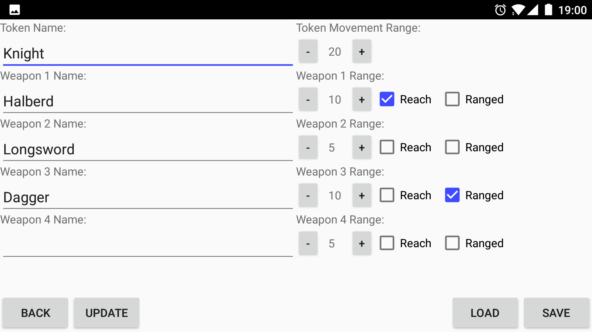

# PathfindAR-Mobile
, by Rhys Agombar, Mark Green

## PathfindAR: An Augmented Reality App For Grid Navigation In TTRPGs

## Abstract
Tabletop gaming sessions are time consuming endeavors, since the math and strategy applied each turn needs to be calculated entirely by it’s human players. Movement and attack ranges, areas of danger, and other pieces of grid information all need to be computed on the fly, which, when done by humans, is slow and prone to errors. To alleviate this, we present ‘PathfindAR’, an augmented reality computer vision app that assists players with grid based navigation and range finding for tabletop role playing games. These activities are two of the most common and time consuming tasks that players do each turn, so by offloading these calculations to a computer, we can improve the speed of game play and make the overall experience more enjoyable.
	
Utilizing a combination of marker detection, contour detection and positional tracking, we developed a portable system for android devices. The system computes and displays grid-related data by analyzing images taken from the device’s camera and shading the affected grid squares with task-specific colours on the android device’s screen. By allowing the android device to handle the tasks of range finding and navigation, this system allows players to make informed decisions on their turns quicker and lets them focus on the more fun aspects of strategy and game play rather than counting grid squares.

## Images
No Overlay

Tokens Only

Movement Range Mode

Movement Plotting Mode

Blast Template Modes

Attack Range Modes

Token Menu Screens

